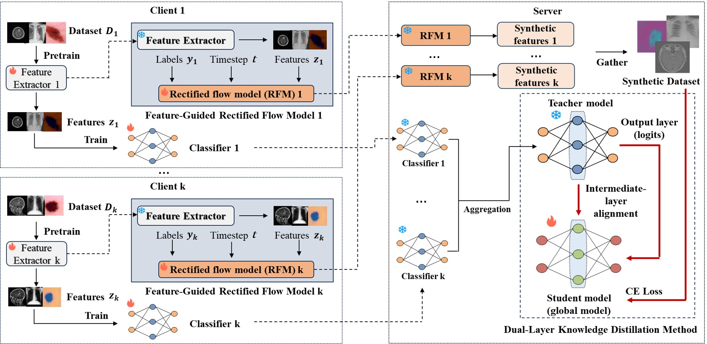

# one-shot-fl-medical
This repository contains the official implementation of our paper:

["A New One-Shot Federated Learning Framework for Medical Imaging Classification with Feature-Guided Rectified Flow and Knowledge Distillation (ECAI 2025)"](https://arxiv.org/abs/2507.19045)



## ✨ Introduction
In this work, we propose a novel One-Shot Federated Learning (OSFL) framework for medical imaging to enhance privacy 
protection and training efficiency. We design the Feature-Guided Rectified Flow Model (FG-RF) to learn from 
feature-level images instead of pixel-level images, effectively reducing privacy risks and accelerating local training. 
Inaddition, we develop Dual-Layer Knowledge Distillation (DLKD) method to dynamically align output logits
and intermediate-layer features during global model aggregation, improving generalization across heterogeneous medical 
data.

## 📦 Installation
This codebase is mainly implemented by python 3.10, Pytorch 2.6.0, CUDA 12.6 version.

Clone the repository and install dependencies:
```bash
git clone https://github.com/LMIAPC/one-shot-fl-medical.git
cd one-shot-fl-medical
pip install -r requirements.txt
```

## 📑 Datasets
- [Brain Tumor Classification dataset](https://www.kaggle.com/datasets/sartajbhuvaji/brain-tumor-classification-mri)
- [HAM10000 dataset](https://www.nature.com/articles/sdata2018161.pdf)
- [Chest X-Ray Tuberculosis dataset](https://doi.org/10.48550/arXiv.2403.07838)

## 🚀 Run the codes
1. Pretrain the feature extractor:
```
CUDA_VISIBLE_DEVICES=0 python train_feature_extractor.py \
    --dataset='brain_tumor' \
    --channels=1 \
    --num_classes=4 \
    --batch_size=32 \
    --num_epochs=100 \
    --learning_rate=0.0001 \
    --seed=66
```

2. Train the teacher model in the client side:
```
CUDA_VISIBLE_DEVICES=0 python one-shot.py \
    --train_type='teacher' \
    --dataset='brain_tumor' \
    --channels=1 \
    --num_classes=4 \
    --dis_epoch=100 \
    --batch_size=32 \
    --learning_rate=0.0001 \
    --seed=66
```

3. Train FG-RF in each client:
```
python train_FGRF.py \
    --dataset='brain_tumor' \
    --num_classes=4 \
    --channels=1 \
    --epochs=800 \
    --batch_size=16 \
    --cuda=0 \
    --client=0 \
    --image_size=224  
```
```
python train_FGRF.py \
    --dataset='brain_tumor' \
    --num_classes=4 \
    --channels=1 \
    --epochs=800 \
    --batch_size=16 \
    --cuda=0 \
    --client=1 \
    --image_size=224  
```
```
python train_FGRF.py \
    --dataset='brain_tumor' \
    --num_classes=4 \
    --channels=1 \
    --epochs=800 \
    --batch_size=16 \
    --cuda=0 \
    --client=2 \
    --image_size=224 
```

4. Generate features in the server:
```
python server_generation.py \
    --dataset='brain_tumor' \
    --num_classes=4 \
    --channels=1 \
    --image_size=224 \
    --cuda=0 \
    --client=0
```
```
python server_generation.py \
    --dataset='brain_tumor' \
    --num_classes=4 \
    --channels=1 \
    --image_size=224 \
    --cuda=0 \
    --client=1
```
```
python server_generation.py \
    --dataset='brain_tumor' \
    --num_classes=4 \
    --channels=1 \
    --image_size=224 \
    --cuda=0 \
    --client=2
```

5. Train Dual-Layer Knowledge Distillation in the server:
```
CUDA_VISIBLE_DEVICES=0 python one-shot.py \
    --train_type='student' \
    --dataset='brain_tumor' \
    --channels=1 \
    --num_classes=4 \
    --dis_epoch=100 \
    --alpha=0.5 \
    --dis_beta=0.5 \
    --batch_size=32 \
    --learning_rate=0.0001 \
    --T=3 \
    --label_s=0.1 \
    --seed=66
```

6. **Key Arguments:**

   - `--train_type`: Choose the teacher or student model for training in knowledge distillation.
   - `--dataset`: Choose the dataset for training
   - `--channel`: Number of image channels
   - `--dis_epoch`: Number of epochs for knowledge distillation
   - `--alpha`: Coefficient for knowledge distillation
   - `--dis_beta`: Coefficient for knowledge distillation
   - `--T`: Temperature coefficient for knowledge distillation
   - `--label_s`: Label smoothing factor for knowledge distillation
   - `--num_epochs`: Epochs for training feature extractor
   - `--cuda`: CUDA device index
   - `--epochs`: Epochs for training FG-RF
   - `--client`: Client index
   - `--seed`: Random seed


## 🎉 Citation
If you find our work helpful, please cite our paper:
```
@article{ma2025new,
  title={A New One-Shot Federated Learning Framework for Medical Imaging Classification with Feature-Guided Rectified Flow and Knowledge Distillation},
  author={Ma, Yufei and Zhang, Hanwen and Yang, Qiya and Luo, Guibo and Zhu, Yuesheng},
  journal={arXiv preprint arXiv:2507.19045},
  year={2025}
}
```

## ✏️ Acknowledgements
Thanks to the work: [minRF](https://github.com/cloneofsimo/minRF) (Licensed under the Apache License, Version 2.0.)


